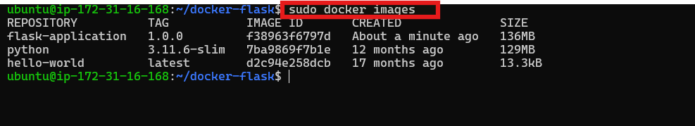
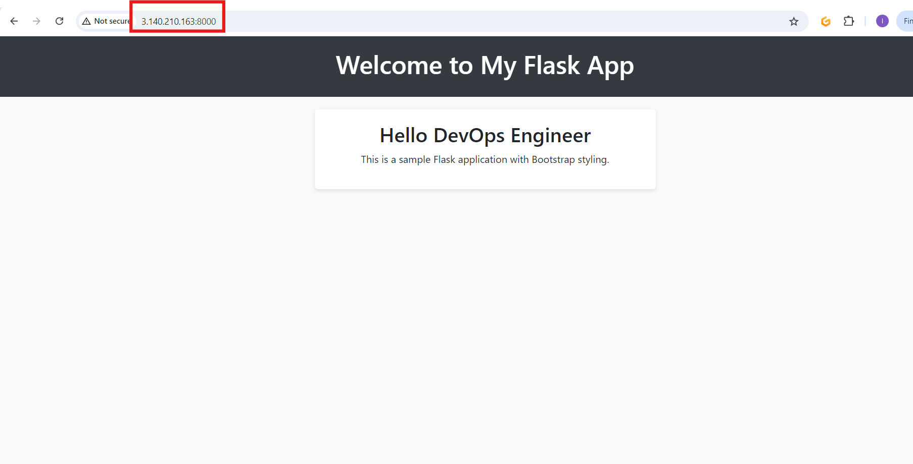

# Project 9 - DOCKER

Docker is a containerization platform that simplifies how applications are built, shared, and run across environments. It ocker allows you to package your app and its dependencies into a small, isolated unit known as a container.

## Dockerfile: Building First Image

### Spinning of Instance

Using the knowledge from previous projects, i spinned an Ubuntu server ans SSH into the instance

### Installing and Starting Docker

- I ran commands as shown below:

-To install Docker:

- To start and check the Status of Docker:

### Cloning the Docker Project Repository:

- The docker file

### Running the Docker Application

- To build the Docker Image:

- To check if the image built

- To check the Docker Container

- To test if the browser is running properly, go to browser and access the EC2 public IP as shown below:

- As seen above, the page will not load as we have not added the port 8000 to the inbound rules of our security group of our instance as shown below:

- Once that is done, reload the browser and we should have the image shown below:

## Pushing the image to docker hub

### Create a Docker Hub Account.

- After creating a Docker hun=b account, I followed the steps below:

### Log In to Docker Hub from Terminal with the steps shown below:

After pushing the image, I followed the steps as shown below:

# The End
